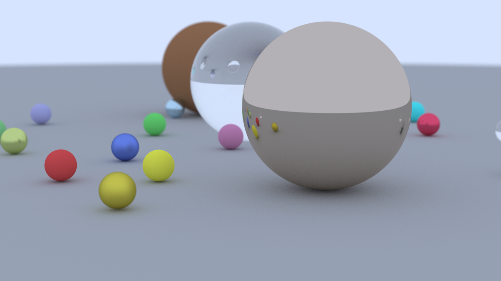

# Scala Ray Tracer

A small Monte Carlo path tracer written in Scala. Scenes are described with a lightweight text format, rendered via ScalaFX for interactive previews, and can be animated by producing frame sequences that are later turned into video.

## Prerequisites
- Java 17+ (tested with Eclipse Adoptium 23.0.1)
- sbt 1.11.x
- (Optional) [FFmpeg](https://ffmpeg.org/) for assembling animations

## Rendering a Still Scene
Use the `Main` entry point whenever you want to render a single scene file and preview/export it immediately.

```bash
sbt compile && sbt "runMain Main"
```

What this does:
1. Compiles the project (only re-runs when sources change).
2. Launches `Main`, which:
   - Parses `samples/sample.txt` by default (pass a path to override, e.g. `sbt "runMain Main samples/scene2.txt"`).
   - Renders a 16:9 frame with stochastic sampling, respecting the camera/material settings described in the text file.
   - Saves the result as `samples/sample.png` beside the scene description (try `samples/alt_sample.txt` for a different setup).
   - Opens a ScalaFX window so you can inspect the render without hunting for the PNG on disk.



## Generating Animation Frames
The `Animate` entry point renders a scripted shot with a moving metallic sphere and writes every sampled frame to the `frames/` directory.

```bash
sbt compile && sbt "runMain Animate"
```

What this does:
1. Compiles the project if needed.
2. Runs `Animate`, which:
   - Reuses the same static geometry as the still scene.
   - Moves a small sphere from left to right over 240 frames (10 seconds at 24 fps).
   - Writes each frame to `frames/frame_XXXX.png`, already gamma-corrected and ready for video assembly.
   - Uses the parameters currently hard-coded in `src/main/scala/Animate.scala`, but you can tweak frame counts, trajectories, materials, sampling depth, or even swap the static scene objects right inside that file before rerunning the command.

Because the animation pipeline is scripted, you have two convenient places to customize the look and duration:
1. **Animate.scala** – change `numFrames`, sampling rates, camera placement, and the procedural motion curves to create entirely different moves without touching FFmpeg.
2. **FFmpeg command** – adjust `-framerate`, `-crf`, or output codecs once the frames exist to target specific delivery formats.

## Building a Video from Frames
Once the frames exist, stitch them into a video with FFmpeg:

```bash
ffmpeg -framerate 24 -i frame_%04d.png -c:v libx264 -pix_fmt yuv420p -crf 18 output.mp4
```

We used this exact command to produce [`animate.mp4`](samples/animate.mp4), which showcases the default moving-sphere shot. Adjust the `-crf` value (lower = higher quality) or `-framerate` to taste.


https://github.com/user-attachments/assets/e7d49f96-e716-4906-aefa-21ac7fde4fed


## Scene Authoring Notes
- Scene files live under `samples/` and are parsed by `ViewParser.scala`.
- Supported directives include background color, camera parameters, recursion depth, samples-per-pixel, and `sphere` definitions with Lambertian, Metal (with fuzz), or Dielectric materials.
- Comments (`# like this`) and blank lines are ignored, making it easy to document complex setups.

With these commands you can quickly iterate on static renders, generate animation plates, and keep the exported media (PNG or MP4) under version control. Have fun tracing!*** End Patch
